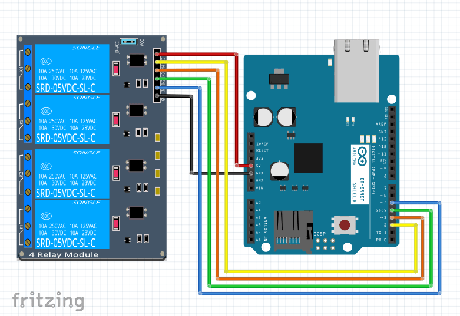

# Acionamento Remoto de Relés
> Protótipo de acionamento via Ethernet de um módulo de relés

[![NPM Version][npm-image]][npm-url]
[![Build Status][travis-image]][travis-url]
[![Downloads Stats][npm-downloads]][npm-url]

A aplicação realiza o ativamento e desativamento de relés por meio de uma request http realizada por meio de uma página HTML

## Exemplo de uso

Pode ser utilizado em protótipos de automação residencial, bem como controle remoto de dispostivos na IoT

_Para mais informação acesse a [Wiki][wiki]._

## Release History

* 0.0.1
    * Código validado e em funcionamento

## Contribuitors

Wanghley Soares Martins - [Github](https://github.com/Wanghley/) – [@wanghley](https://www.instagram.com/Wanghley/) – wanghley.soares.martins@gmail.com

Marina Márcia Costa de Souza - [Github](https://github.com/micro-chip2019/) – [@marinamcsouza](https://www.instagram.com/marinamcsouza/) – marinamcsouza@gmail.com

## Contributing

1. Fork it (<https://github.com/dev-ornitorrincos/Acionamento-De-Reles/fork>)
2. Create your feature branch (`git checkout -b feature/fooBar`)
3. Commit your changes (`git commit -am 'Add some fooBar'`)
4. Push to the branch (`git push origin feature/fooBar`)
5. Create a new Pull Request

<!-- Markdown link & img dfn's -->
[npm-image]: https://img.shields.io/npm/v/datadog-metrics.svg?style=flat-square
[npm-url]: https://npmjs.org/package/datadog-metrics
[npm-downloads]: https://img.shields.io/npm/dm/datadog-metrics.svg?style=flat-square
[travis-image]: https://img.shields.io/travis/dbader/node-datadog-metrics/master.svg?style=flat-square
[travis-url]: https://travis-ci.org/dbader/node-datadog-metrics
[wiki]: https://github.com/yourname/yourproject/wiki

